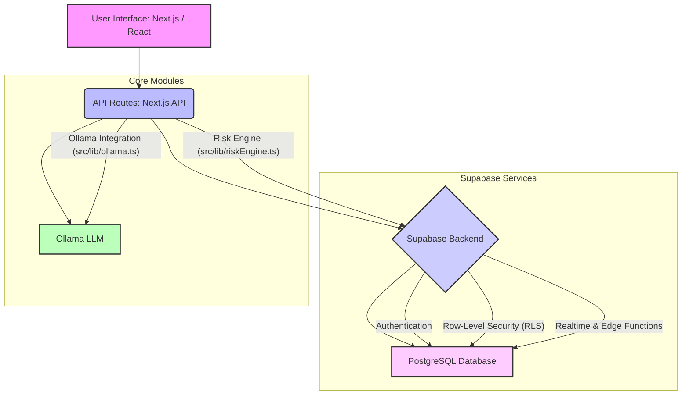

# Liver Analysis: AI-Assisted Liver Health Assessment Platform

Liver Analysis is a comprehensive web platform designed to streamline and enhance the process of liver function test (LFT) evaluation for healthcare professionals and patients. Leveraging advanced rule-based risk assessment and artificial intelligence, Liver Analysis provides rapid, secure, and understandable insights into liver health.

## Core Features

-   **Clinical Risk Evaluation**: Utilizes a sophisticated rule-based engine to accurately assess liver health based on LFT values, clinical symptoms, and histological findings, mapping them to clear medical risk levels.
-   **AI Medical Explanation**: Integrates an AI model to generate plain-language explanations of complex medical reports, enabling patients to better understand their results and condition.
-   **Secure Cloud Storage**: Ensures the utmost data privacy and security through Supabase's Row-Level Security (RLS), guaranteeing that sensitive health information is isolated and accessible only to authorized individuals.

## User Roles and Use Cases

Liver Analysis supports three distinct user roles, each with tailored functionalities and access levels:

### Admin

The Admin role is responsible for the overall management and oversight of the Liver Analysis platform.

-   **System Overview**: Access a comprehensive dashboard displaying key performance indicators such as total doctors, total patients, total reports generated, and the number of high-risk cases.
-   **User Management**: Create new doctor and patient accounts, and manage existing user profiles, including assigning patients to specific doctors.
-   **Template Management**: Create, edit, and activate custom report templates for branding and standardized reporting. Only one template can be active at a time to maintain consistency.
-   **Analytics**: Monitor platform usage and health trends through integrated analytics.

### Doctor

The Doctor role is at the forefront of patient care, utilizing Liver Analysis for efficient liver health assessment and management.

-   **Create New Liver Reports**: Input patient demographic data (if new), Liver Function Test (LFT) values, detailed clinical symptoms, and histological findings to generate a comprehensive liver health report.
-   **View and Manage Own Reports**: Access a personalized dashboard to view all reports they have created, categorized by risk level.
-   **Manage Assigned Patients**: View and manage the list of patients assigned to them.
-   **Generate AI Explanations**: Utilize the integrated AI to generate clear, patient-friendly summaries for each report, aiding in patient education.
-   **Create Prescriptions**: Document and assign prescriptions and follow-up dates directly linked to specific patient reports.

### Patient

The Patient role provides secure and accessible insight into their own liver health journey.

-   **View Personal Liver Reports**: Access a secure dashboard to view all liver health reports generated for them by their assigned doctor.
-   **View Prescriptions**: Review any prescriptions or follow-up instructions provided by their doctor for their specific reports.

## How Liver Analysis Works (Process Flow)

Liver Analysis orchestrates a seamless flow of data and intelligence to provide comprehensive liver health assessments:

1.  **User Authentication & Authorization**: All users (Admin, Doctor, Patient) log in via a secure Supabase-backed authentication system. Role-based access control (RBAC), enforced by Supabase Row-Level Security (RLS) and API route checks, ensures that each user can only access functionalities and data relevant to their role.
2.  **Report Creation (Doctor)**:
    -   A doctor initiates a new report, inputting a patient's ID (or creating a new patient profile if necessary), Liver Function Test (LFT) values (Total Bilirubin, SGPT/ALT, SGOT/AST, Albumin, Alkaline Phosphatase, Prothrombin Time), clinical symptoms (fatigue, spider angioma, ascites, varices), medical history (steroid use, antivirals), and histological findings (fibrosis stage: F1-F4).
    -   Upon submission, the system securely fetches the patient's demographic information (age, gender) from their profile.
    -   The `riskEngine` module processes these inputs through its rule-based algorithm to calculate a numerical risk score and assign a corresponding risk level (Low, Moderate, High, Critical).
    -   Concurrently, the `ollama` integration generates a personalized, plain-language AI summary that explains the report findings, the determined risk level, and general medical context.
    -   The complete liver report, including all input parameters, the calculated risk score, risk level, and the AI-generated summary, is then securely stored in the `liver_reports` table within Supabase.
3.  **Prescription Management (Doctor)**:
    -   Following a report, a doctor can create a prescription, specifying medication, dosage, and a follow-up date, directly linking it to the patient's liver report.
    -   This prescription is stored securely and is accessible only to the creating doctor and the assigned patient.
4.  **Report & Prescription Viewing (Patient)**:
    -   Patients can log in to their personalized dashboard to securely view all their assigned liver reports and associated prescriptions. RLS policies ensure that patients can only access their own data.
5.  **Admin System Management**: 
    -   Admins have elevated privileges to oversee all aspects of the platform. This includes creating and managing user accounts (doctors and patients), assigning doctors to patients, and customizing the visual branding and disclaimer text of patient reports through a template management system.

## Formulas Used: The Liver Analysis Risk Engine

Liver Analysis's clinical risk evaluation is powered by a sophisticated, rule-based risk engine. This engine assigns a numerical score based on a comprehensive set of liver function test values, clinical symptoms, medical history, and histological findings. The accumulated score directly correlates to the patient's liver health risk level.

The `calculateRisk` function evaluates the following parameters:

1.  **Core Lab Values**:
    -   **Total Bilirubin (Normal: 0.1 - 1.2 mg/dL)**: Higher values significantly increase the risk score (e.g., >2.0 mg/dL adds 4 points).
    -   **SGPT / ALT (Normal: 7 - 56 U/L)**: Elevated levels contribute to the score (e.g., >100 U/L adds 3 points; >200 U/L adds 5 points).
    -   **SGOT / AST (Normal: 8 - 48 U/L)**: Similar to SGPT, elevated levels increase risk (e.g., >100 U/L adds 3 points; >200 U/L adds 5 points).
    -   **Albumin (Normal: 3.5 - 5.0 g/dL)**: Lower levels indicate higher risk (e.g., <3.5 g/dL adds 3 points; <2.8 g/dL adds 5 points).

2.  **Advanced Biomarkers**:
    -   **Alkaline Phosphatase (Normal: 44 - 147 U/L)**: Elevated levels increase the score (e.g., >147 U/L adds 2 points; >300 U/L adds 4 points).
    -   **Prothrombin Time (Normal: 11 - 13.5 seconds)**: Prolonged time increases the score (e.g., >13.5 seconds adds 2 points; >20 seconds adds 4 points).

3.  **Clinical Symptoms & History (Binary Flags)**:
    -   **Fatigue**: Adds 1 point (common but non-specific).
    -   **Spider Angioma**: Adds 2 points (sign of chronic liver disease).
    -   **Ascites**: Adds 5 points (major sign of decompensated cirrhosis).
    -   **Varices**: Adds 5 points (indicates portal hypertension).
    -   **Steroid Use**: Adds 2 points.
    -   **Antivirals**: Adds 2 points.

4.  **Histology Scoring (Fibrosis Stage)**:
    -   **F1**: Adds 1 point.
    -   **F2**: Adds 2 points.
    -   **F3**: Adds 4 points.
    -   **F4 (Cirrhosis)**: Adds 6 points.

**Risk Level Determination**:

The total calculated score is then mapped to one of the following risk levels:

-   **Low**: Score < 5
-   **Moderate**: Score between 5 and 15
-   **High**: Score between 16 and 25
-   **Critical**: Score > 25

A probability percentage is also calculated, reflecting the severity of the risk relative to a maximum theoretical score.

## Architecture

Liver Analysis is built on a modern, scalable, and secure architecture designed for high performance and data integrity.

### Technology Stack:

-   **Frontend**: Built with [Next.js](https://nextjs.org/), [React](https://react.dev/), and [TypeScript](https://www.typescriptlang.org/) for a dynamic and type-safe user interface. Styling is managed using [Tailwind CSS](https://tailwindcss.com/) and [Shadcn/ui](https://ui.shadcn.com/).
-   **Backend & Database**: Leverages [Supabase](https://supabase.com/) as its backend-as-a-service, providing:
    -   **PostgreSQL**: A robust relational database for all application data.
    -   **Authentication**: Secure user login and session management.
    -   **Row-Level Security (RLS)**: Fine-grained access control at the database level, ensuring data privacy.
    -   **Realtime**: Potential for real-time updates (though not explicitly used in current report flow).
    -   **Edge Functions**: For server-side logic and API routes.
-   **AI / LLM Integration**: Incorporates [Ollama](https://ollama.com/) for running large language models locally or on a private server, enabling the generation of contextual medical explanations for patient reports.
-   **PDF Generation**: Utilizes `html2pdf.js` for converting report content into printable PDF documents.

## Restrictions

To maintain data integrity, security, and role-based responsibilities, Liver Analysis implements the following restrictions:

-   **Strict Role-Based Access**: Access to features and data is strictly controlled by user role. A user's authenticated role (Admin, Doctor, or Patient) determines their permissible actions and data visibility.
-   **Doctor-Only Report Creation**: Only authenticated users with the 'Doctor' role are authorized to create new liver health reports and generate prescriptions.
-   **Admin-Only User and Template Management**: Only 'Admin' users have the capability to create new user accounts, assign patients to doctors, and manage (create, update, activate) report templates.
-   **Patient Data Isolation**: Patients can exclusively view their own liver reports and associated prescriptions. Row-Level Security (RLS) policies at the database level prevent unauthorized access to other patient's data.
-   **Single Active Report Template**: To ensure consistency in reporting, only one report template can be designated as 'active' at any given time. This is enforced both at the application logic and database level.

## Why Liver Analysis is Better

Liver Analysis offers significant advantages over traditional liver function test evaluation methods, making it a superior choice for modern healthcare:

-   **Enhanced Speed and Efficiency**: Automates the complex process of risk assessment and report generation, drastically reducing the time required for LFT evaluation. Doctors can process more cases efficiently, improving clinic throughput.
-   **Clinical Accuracy and Consistency**: The rule-based risk engine ensures a standardized and clinically accurate assessment of liver health, minimizing human error and inter-clinician variability in risk determination.
-   **Improved Patient Understanding**: AI-generated medical explanations translate complex medical jargon into clear, digestible language. This empowers patients to better understand their condition, risk levels, and treatment plans, fostering greater engagement and adherence.
-   **Robust Data Security and Privacy**: Built on Supabase with meticulous Row-Level Security (RLS) implementation, Liver Analysis provides enterprise-grade data protection. Patient data is isolated, secure, and compliant with stringent privacy requirements, ensuring sensitive health information remains confidential.
-   **Scalable and Reliable Infrastructure**: Leveraging Next.js and Supabase, the platform is designed for scalability, capable of handling a growing number of users and reports without compromising performance or reliability.
-   **Streamlined Clinical Workflow**: Consolidates patient management, report generation, risk assessment, and prescription documentation into a single, intuitive platform, simplifying the doctor's workflow and reducing administrative burden.
-   **Customizable Reporting**: Admins can tailor report templates to match hospital branding and integrate specific disclaimers, offering flexibility while maintaining a professional appearance.
